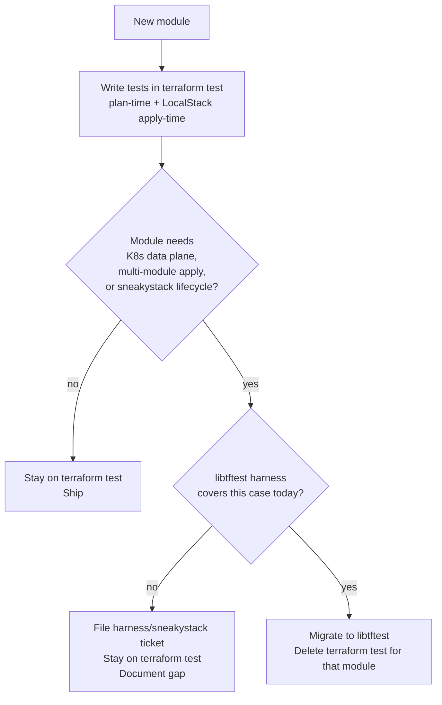
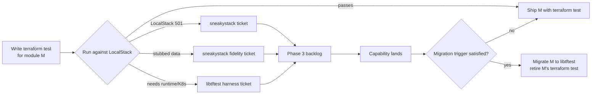

<!-- markdownlint-disable-file MD025 MD041 -->

# RFC 0001: Module Testing Strategy: terraform test as baseline, libtftest for runtime

**Status:** Draft
**Author:** Donald Gifford
**Date:** 2026-05-15

<!--toc:start-->
- [Summary](#summary)
- [Problem Statement](#problem-statement)
- [Proposed Solution](#proposed-solution)
- [Design](#design)
  - [Shared backend: both frameworks run on LocalStack](#shared-backend-both-frameworks-run-on-localstack)
  - [Capability matrix](#capability-matrix)
  - [Migration trigger](#migration-trigger)
  - [Workflow diagram](#workflow-diagram)
  - [terraform test as the gap-discovery tool](#terraform-test-as-the-gap-discovery-tool)
  - [Where cluster sits](#where-cluster-sits)
- [Alternatives Considered](#alternatives-considered)
- [Implementation Phases](#implementation-phases)
  - [Phase 1: Land the strategy on the cluster PR](#phase-1-land-the-strategy-on-the-cluster-pr)
  - [Phase 2: terraform test pass across the remaining fleet](#phase-2-terraform-test-pass-across-the-remaining-fleet)
  - [Phase 3: libtftest harness engineering (parallel track)](#phase-3-libtftest-harness-engineering-parallel-track)
  - [Phase 4: Triggered migrations](#phase-4-triggered-migrations)
- [Risks and Mitigations](#risks-and-mitigations)
- [Success Criteria](#success-criteria)
- [References](#references)
<!--toc:end-->

## Summary

Adopt a two-framework testing strategy for the EKS module fleet:
**`terraform test` is the baseline** for every module's plan-time and
single-module apply-time invariants. **libtftest is the runtime track**
for end-to-end, multi-module, K8s-data-plane validation that needs the
LocalStack + kind/k3d + sneakystack shim. Both frameworks run against
**the same LocalStack backend** — the migration decision is therefore
narrower than "real vs mocked" and centers on kind/k3d data plane,
multi-module apply orchestration, sneakystack lifecycle, and Go
ergonomics.

`terraform test` does double duty: it ships baseline CI coverage today
*and* it is the diagnostic tool that surfaces gaps — LocalStack APIs
that return 501, behaviors stubbed but not modeled, runtime invariants
HCL `assert` cannot express. Those gaps become the authoritative
libtftest + sneakystack backlog. The framework choice for any module
is driven by evidence from this discovery loop, not speculation.

## Problem Statement

The fleet needs a testing strategy that:

1. **Validates Terraform module behavior without an AWS account.** The
   org's testing posture is "no sandbox AWS account required for module
   CI." Every contributor's laptop and every CI run has to produce real
   feedback against the modules without IAM provisioning, blast-radius
   concerns, or per-PR cost.
2. **Catches both plan-time invariants and runtime behavior.** Plan-time
   (resource shape, IAM policy documents, output contracts, dependency
   ordering) is fast and high-value, but it cannot validate
   apply-time things like addon DaemonSet readiness, node kubelet join,
   or pod identity token exchange.
3. **Scales across the fleet without compounding fixture cost.** Every
   downstream module reads cluster + VPC remote state. If every module
   re-pays a LocalStack-S3-seeding boilerplate cost, the test surface
   grows faster than the value.
4. **Doesn't fracture the framework.** Two competing approaches that
   answer the same question is overhead with no return. The strategy
   has to pick lanes deliberately.
5. **Surfaces its own backlog from evidence.** We don't know what
   libtftest needs to add (or what sneakystack needs to proxy) until
   we try to test something and watch it fail. Without a cheap, fast
   way to attempt every module's apply-time invariants, the
   libtftest/sneakystack roadmap is guesswork.

The cluster module's Phase 8 (libtftest) is a working data point: it
validates plan-time invariants today, but the LocalStack scaffolding it
carries is overhead for plan-only work. Meanwhile, the EKS-specific
runtime invariants (does the agent DaemonSet actually run? does the
node actually join?) that libtftest's LocalStack + kind/k3d shim is
designed to validate are *exactly* what we cannot reach with
`terraform test` alone.

## Proposed Solution

Two frameworks, deliberately separated by what they validate:

| Framework        | Owns                                                                                       | Backend                          |
| ---------------- | ------------------------------------------------------------------------------------------ | -------------------------------- |
| `terraform test` | Plan-time invariants and single-module apply-time invariants on AWS-API-only resources     | LocalStack (Pro)                 |
| libtftest        | End-to-end runtime validation: K8s data plane, multi-module apply chains, controller wiring | LocalStack + kind/k3d + sneakystack |

The strategy:

1. **`terraform test` is the default for new modules.** Every module
   ships with a `tests/*.tftest.hcl` suite from day one. It runs in
   seconds, against LocalStack, with HCL `assert` blocks. No Go
   required.
2. **libtftest is reached for when a specific runtime invariant cannot
   be validated otherwise.** "Can't validate" means: the test depends
   on the K8s data plane, on multi-module apply orchestration, on
   sneakystack proxy lifecycle, or on Go-side complexity that HCL
   `assert` cannot express ergonomically.
3. **Cluster is the side-by-side reference module.** Phase 8
   (libtftest, plan-only) stays. A `tests/*.tftest.hcl` suite for the
   same plan-time invariants is added alongside as the comparison
   artifact. No other module carries both frameworks at once.
4. **Apply-time validation against real AWS is out of scope for the
   module repo.** That belongs to the consumer Terragrunt stack in
   infrastructure-live, against a sandbox AWS account. This RFC
   covers the module-local testing layer only.

## Design

### Shared backend: both frameworks run on LocalStack

This is the load-bearing detail that sharpens the migration calculus.

`terraform test` is not limited to mocked providers. With the AWS
provider's `endpoints` override and `AWS_ENDPOINT_URL`, `terraform test`
can run against LocalStack just like libtftest does. That means:

- LocalStack investment (Pro license, services enabled, sneakystack
  proxies for missing APIs) is **shared** across both frameworks. A
  sneakystack ticket benefits both.
- The decision tree narrows. We're not choosing between "fake AWS"
  and "real AWS" — we're choosing between "HCL assertions against
  LocalStack" and "Go orchestration + kind/k3d data plane against the
  same LocalStack."
- `terraform test`'s apply-time mode (`command = apply`) is **usable**
  for AWS-API-only modules. It's not just plan-time.

### Capability matrix

| Capability                                            | `terraform test` | libtftest | Notes                                                                           |
| ----------------------------------------------------- | ---------------- | --------- | ------------------------------------------------------------------------------- |
| Plan-time resource/output assertions                  | ✅                | ✅         | Both expressible; HCL `assert` is ~5x more concise than Go plan-JSON walking.   |
| Stub remote-state outputs                             | ✅ (`override_data`) | ✅ (S3 seed) | `override_data` is a single block; libtftest seeds a real LocalStack S3 object. |
| Apply against LocalStack (AWS-API only)               | ✅                | ✅         | Both work; libtftest manages the LocalStack lifecycle, `terraform test` doesn't. |
| Multi-module apply orchestration                      | ❌                | ✅         | `terraform test` is single-module; cross-module seeding is awkward.             |
| K8s data plane (DaemonSet ready, kubelet join)        | ❌                | ✅ (planned) | Requires kind/k3d bridge — libtftest's roadmap area.                            |
| sneakystack proxy lifecycle                           | ⚠️                | ✅         | `terraform test` can consume sneakystack via env vars; libtftest manages it.    |
| Complex assertion logic (regex, JSON walk, iteration) | ⚠️                | ✅         | HCL assert is enough for most; Go wins on edge cases.                           |
| CI runtime                                            | Fast (seconds)   | Slower (45s+ for plan-only today) | Driven by harness setup cost.                              |
| Onboarding cost                                       | Low (HCL only)   | Higher (Go + harness API) | Affects who can contribute tests.                                   |

### Migration trigger

A module migrates from `terraform test` to libtftest when **both** hold:

1. **Capability gate.** libtftest can apply-test the module against
   LocalStack + kind/k3d + sneakystack today (the harness covers it).
2. **Value gate.** At least one invariant the module needs to validate
   is **not catchable** at `terraform test` time — i.e., apply-time
   runtime behavior, multi-module sequencing, or K8s data plane state.

If only (1) holds but no invariant requires it, **stay on `terraform test`**.
The cost of switching is non-zero and the value has to be earned.

If only (2) holds (we need it but the harness can't do it yet), **file
a libtftest harness or sneakystack ticket** rather than migrating into
a half-working state.

### Workflow diagram

The "delete terraform test for that module" step matters — it keeps
the no-fracture principle honest. A migrated module carries libtftest
*only*, not both.

### `terraform test` as the gap-discovery tool

This is the load-bearing operational point. `terraform test` is fast,
cheap, and runs against the same LocalStack we'd use for libtftest.
That makes it the right tool to *try things* with — and watch what
fails.

When a `terraform test` `run` block with `command = apply` is
authored for a module:

- **It succeeds** → the AWS-API surface is fully LocalStack-supported.
  No libtftest/sneakystack work needed for those resources.
- **LocalStack returns 501 / NotImplemented** → that's a **sneakystack
  ticket**. Concrete, named, scoped to a specific API call. Not a
  guess.
- **LocalStack returns success but with stub/empty data that the
  module's downstream assertions cannot use** → that's a
  **sneakystack fidelity ticket** (proxy through, enrich the
  response).
- **The invariant we need to assert is runtime / K8s-data-plane / a
  multi-module apply chain** → HCL `assert` cannot express it →
  that's a **libtftest harness ticket** (kind/k3d bridge, addon
  manifest mirroring, pod-identity token exchange, etc.).

Every failure mode produces a backlog item. The Phase 2 fleet-wide
`terraform test` pass is therefore not just shipping coverage — it is
the systematic enumeration of what Phase 3 (libtftest harness +
sneakystack) needs to build, derived from real attempts rather than
speculation.

This is the feedback loop:

### Where cluster sits

Cluster is the **side-by-side reference module**, by design and by
exception. It carries:

- `modules/eks/cluster/test/` — libtftest Go suite (Phase 8,
  plan-only).
- `modules/eks/cluster/tests/` — `terraform test` HCL suite asserting
  the same plan-time invariants.

This is *deliberate, bounded fracture*. Purpose: produce the
side-by-side data (line count, runtime, ergonomics, what each catches
that the other doesn't) that grounds the migration trigger in
evidence rather than speculation. **No other module carries both.**

When the cluster module eventually grows apply-time runtime tests
(once the LocalStack + kind/k3d bridge is real), the `terraform test`
suite for cluster gets retired and libtftest carries the full surface,
per the same migration trigger.

## Alternatives Considered

**libtftest-only across the fleet (status quo direction before this RFC).**
Rejected. Pays LocalStack scaffolding cost on every module for plan-only
assertions that don't need it. Compounds fixture cost across the fleet.
Blocks module work on harness engineering completion.

**`terraform test`-only across the fleet, no libtftest.**
Rejected. Cannot validate K8s data plane, addon DaemonSet readiness, or
pod identity token exchange. Forces those invariants to a sandbox AWS
account at the Terragrunt-unit level, which contradicts the "no AWS
account required for module CI" posture.

**terratest with hand-rolled LocalStack wiring.**
Rejected. Re-builds the libtftest shim per repo. The kind/k3d bridge
and sneakystack proxy are libtftest's reason to exist; rolling them
ad hoc forfeits that investment.

**Real AWS sandbox account from module CI.**
Rejected for module-local tests. Out of scope cost (account
provisioning, IAM, blast radius, billing). Appropriate at the
consumer Terragrunt stack in infrastructure-live, not here.

**Plan-only forever (no apply tests at any layer).**
Rejected. Apply-time runtime behavior — DaemonSets, node join, token
exchange — is exactly where regressions land. Punting them all to
production is not a strategy.

## Implementation Phases

### Phase 1: Land the strategy on the cluster PR

- Add RFC-0001 (this doc), ADR-0013 (terraform test), ADR-0014
  (libtftest).
- Write `modules/eks/cluster/tests/*.tftest.hcl` covering the same
  plan-time invariants Phase 8 asserts.
- Validate the RFC's claims against the test-writing experience. If
  reality contradicts a claim (e.g., HCL `assert` cannot express some
  invariant that Go can), revise the RFC/ADR before merge.
- Land everything in PR #8.

### Phase 2: terraform test pass across the remaining fleet

- New branch off main after Phase 1 merges.
- For each of: managed-node-group, addons, pod-identity-access,
  ecr-pull-through-cache — design doc updates (or new DESIGN docs
  for the two without one) include a §Testing Strategy section
  referencing this RFC, then write Terraform + `terraform test`
  suites.
- Order recommendation: managed-node-group → addons →
  pod-identity-access → ecr-pull-through-cache. Each builds
  conceptual fluency for the next. ecr-pull-through-cache is the
  most self-contained and is the natural fast-win parallel.
- **Each module's `terraform test` failures feed Phase 3.** When a
  `run` block can't apply because LocalStack returned 501, or when an
  invariant can't be expressed in HCL `assert`, that gets filed as a
  sneakystack or libtftest harness ticket immediately — not buffered
  for later. The Phase 2 deliverable is *both* shipping CI coverage
  *and* the categorized gap report that becomes Phase 3's backlog.

### Phase 3: libtftest harness engineering (parallel track)

Not a module-N task — this is engineering work against the
`libtftest` project itself. **The backlog is generated by Phase 2,
not invented up front.** Likely tickets (based on current
understanding; Phase 2 will refine):

- LocalStack EKS cluster endpoint ↔ kind/k3d kubeconfig bridge (so
  registered node groups can have real workers).
- Addon registration → optional K8s manifest mirroring into kind/k3d
  (so addon DaemonSets actually become ready).
- Pod identity token exchange path (LocalStack STS as OIDC issuer,
  kind/k3d service account tokens).
- sneakystack lifecycle hooks inside `harness.Run`.
- Implement (or fix) the documented `LIBTFTEST_CONTAINER_URL` env
  var in `harness.Run` itself.

Additional tickets land as Phase 2 surfaces them. Each ticket
references the specific module(s) and `tftest.hcl` `run` block that
exposed the gap.

### Phase 4: Triggered migrations

Module-by-module, applying the migration trigger:

- When Phase 3 capability lands for module X *and* X has an
  invariant only apply-time can catch → migrate X to libtftest,
  delete X's `terraform test` suite.
- When Phase 3 capability lands but X has no such invariant →
  stay on `terraform test`. Document the decision.

Cluster's `terraform test` suite retires the day cluster grows its
first true apply-time runtime invariant (likely once the addon /
node-group migrations validate the harness pattern).

## Risks and Mitigations

| Risk                                                            | Impact | Likelihood | Mitigation                                                                                                                                  |
| --------------------------------------------------------------- | ------ | ---------- | ------------------------------------------------------------------------------------------------------------------------------------------- |
| "Interim `terraform test` coverage" becomes permanent           | High   | High       | Migration trigger written down; harness engineering tracked as Phase 3 tickets. Quarterly review of "modules pending migration."             |
| Cluster ends up with two test frameworks long-term              | Medium | Medium     | Explicit retirement criterion: cluster's `terraform test` suite goes when cluster grows its first apply-time runtime invariant.            |
| LocalStack EKS fidelity gaps mask real bugs                     | High   | Medium     | sneakystack proxies for known gaps. Real-AWS validation continues at Terragrunt-unit level in infrastructure-live (out of scope here).      |
| HCL `assert` ergonomics break down on complex IAM policy docs   | Medium | Medium     | First contact with this lands in cluster's `tests/` suite (Phase 1). If real, revise ADR-0013 to scope the limit before fleet rollout.     |
| libtftest harness engineering (Phase 3) underfunded             | High   | Medium     | Phase 3 surfaces as its own ticket track, decoupled from module PRs. Each module's "cannot assert" list (from Phase 2) feeds the backlog. |
| Contributors confused about which framework to use              | Low    | Medium     | Workflow diagram + ADR-0013/0014 are the entry point. Each module README links them.                                                       |

## Success Criteria

- Every EKS module ships with at least a `terraform test` suite
  asserting its plan-time invariants and any LocalStack-reachable
  apply-time invariants.
- Migration decisions are decisions, not drift — every module's
  current framework choice is traceable to the migration trigger.
- Phase 3 libtftest harness and sneakystack tickets are open and
  tracked; **every ticket cites a specific `tftest.hcl` `run` block
  (or HCL assertion attempt) that surfaced the gap**. No
  speculative tickets in the backlog.
- Cluster carries both frameworks **only** until its first
  apply-time runtime invariant is added, then transitions to
  libtftest-only per the retirement criterion.
- No module other than cluster carries both frameworks at any
  point.

## References

- [ADR-0013: Use `terraform test` for plan-time module invariants](../adr/0013-use-terraform-test-for-plan-time-module-invariants.md) *(forthcoming, same PR)*
- [ADR-0014: Use libtftest for apply-time runtime validation without AWS](../adr/0014-use-libtftest-for-apply-time-runtime-validation-without-aws.md) *(forthcoming, same PR)*
- [ADR-0001: Cross-module composition via `terraform_remote_state`](../adr/0001-cross-module-composition-via-terraformremotestate.md)
- [ADR-0003: Pod Identity Agent installed on the addons module](../adr/0003-pod-identity-agent-installed-on-the-addons-module.md)
- [IMPL-0001: EKS Cluster Module Implementation](../impl/0001-eks-cluster-module-implementation.md) — cluster Phase 8 (libtftest) is the reference data point this RFC is grounded in.
- [libtftest](https://github.com/donaldgifford/libtftest) — the harness this RFC depends on.
- [Terraform `test` command](https://developer.hashicorp.com/terraform/language/tests) — HashiCorp's built-in testing framework.
